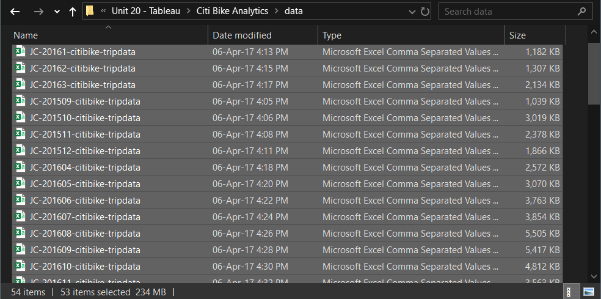
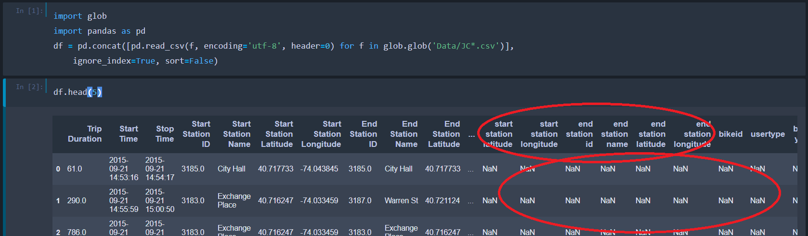
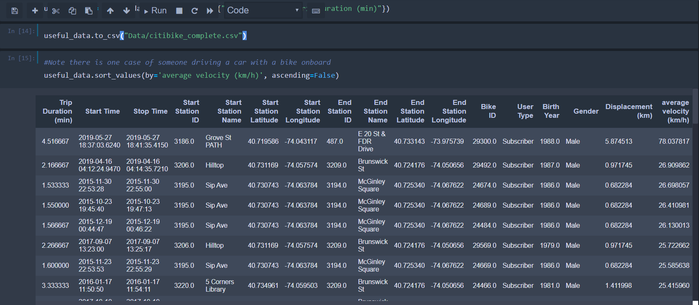

# Tableau - Citi Bike Analytics

## [Tableau](https://public.tableau.com/profile/poomasterx#!/vizhome/CitiBikeStory_15847631751450/CitiBike) <--Click here for visual

## Background

Since 2013, the Citi Bike Program has implemented a robust infrastructure for collecting data on the program's utilization. Through the team's efforts, each month bike data is collected, organized, and made public on the [Citi Bike Data](https://www.citibikenyc.com/system-data) webpage.

However, while the data has been regularly updated, the team has yet to implement a dashboard or sophisticated reporting process. City officials have a number of questions on the program, so my task is to build a set of data reports to provide the answers.

## Procedure

1. Acquire data

Datasets are found online, JC*csvs yields the most compressed files making them easiest to work with. Over 58 csvs are downloaded and unzipped.

2. Organizing Data

Utilizing python glob function and pandas to select all csvs at once based on matching title key. However there is an issue with duplicate columns producing NaNs during merger which requires panda dexterity to solve. It was also found that bike repair and test data was included into the csvs which produced immiscible data and needed to be excluded. Afterwards data is cleaned to produce more displayable data, such as changing gender values, calculating displacement with geographical coordinates and trigonometry and calculating velocity.

Now that all csvs are combined together can move onto importing into Tableau.

3. [Tableau](https://public.tableau.com/profile/poomasterx#!/vizhome/CitiBikeStory_15847631751450/CitiBike) <--Click

